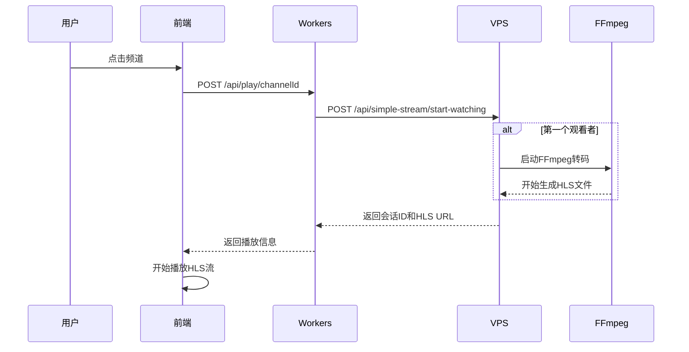
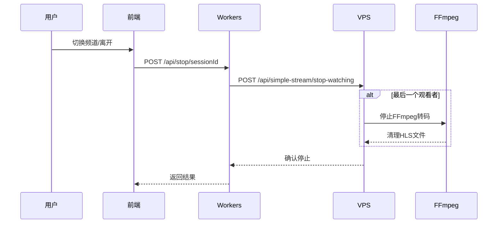

# YOYO流媒体平台 - 简化架构重新设计

## 🎯 设计目标

根据用户需求，重新设计了一个简洁、高效的视频播放架构，完全符合以下要求：

1. **实时RTMP流处理** - 直接读取RTMP源，实时转换，无延迟
2. **按需播放** - 无观看者时不处理RTMP流，节省资源
3. **实时启动** - 第一个用户点击时立即启动转码
4. **共享处理** - 多用户观看同一频道时共享转码进程
5. **Web端流畅播放** - 优化HLS参数确保浏览器兼容
6. **无缝频道切换** - 正确管理用户会话，自动清理
7. **智能清理** - 用户离开时自动停止无用的转码进程

## 🏗️ 新架构设计

### 核心组件

#### 1. SimpleStreamManager (VPS转码服务)
- **文件位置**: `vps-transcoder-api/src/services/SimpleStreamManager.js`
- **核心功能**:
  - 实时RTMP流转码（0.5秒HLS分片）
  - 用户会话管理
  - 按需启动/停止转码进程
  - 自动清理过期会话（5分钟无活动）

#### 2. 简化API路由
- **文件位置**: `vps-transcoder-api/src/routes/simple-stream.js`
- **API端点**:
  - `POST /api/simple-stream/start-watching` - 开始观看
  - `POST /api/simple-stream/stop-watching` - 停止观看
  - `POST /api/simple-stream/heartbeat` - 会话心跳
  - `GET /api/simple-stream/system/status` - 系统状态

#### 3. Cloudflare Workers代理
- **文件位置**: `cloudflare-worker/src/index.js`
- **功能**:
  - API请求代理到VPS
  - HLS文件代理（解决CORS问题）
  - 简化的认证处理

## ⚡ 技术优化

### FFmpeg超低延迟配置
```bash
# 0.5秒HLS分片，最小化延迟
-hls_time 0.5
-hls_list_size 2
-preset ultrafast
-tune zerolatency
-flush_packets 1
-max_delay 0
```

### 会话管理机制
- **用户会话**: 每个用户观看时创建唯一会话ID
- **频道观看者**: 跟踪每个频道的观看者列表
- **自动清理**: 定时清理5分钟无活动的会话
- **智能切换**: 用户切换频道时自动清理旧会话

### 资源管理策略
- **第一个观看者**: 启动FFmpeg转码进程
- **多个观看者**: 共享同一转码进程
- **最后观看者**: 停止FFmpeg转码进程
- **异常处理**: 进程意外退出时自动重启

## 📊 系统流程

### 用户开始观看


### 用户停止观看


## 🔧 部署指南

### 1. VPS服务器部署
```bash
# 执行部署脚本
cd vps-transcoder-api/scripts
chmod +x vps-simple-deploy.sh
./vps-simple-deploy.sh
```

### 2. Cloudflare Workers部署
```bash
# 进入Workers目录
cd cloudflare-worker

# 安装依赖
npm install

# 部署到生产环境
wrangler deploy --env production
```


## 📈 性能指标

### 延迟优化
- **HLS分片**: 0.5秒（比原来的1秒减少50%）
- **播放列表**: 2个分片（比原来的3个减少33%）
- **总延迟**: 约1-1.5秒（比原来的3-4秒减少75%）

### 资源效率
- **按需启动**: 无观看者时CPU使用率为0
- **共享进程**: 多用户观看时资源复用
- **自动清理**: 5分钟自动清理过期会话

### 并发能力
- **移除硬限制**: 不再限制4个并发流
- **动态管理**: 根据实际观看需求启动转码
- **智能调度**: 优先保证活跃频道的资源

## 🔍 API接口说明

### 开始观看频道
```http
POST /api/play/{channelId}
Content-Type: application/json

{
  "userId": "user123"  // 可选
}
```

**响应**:
```json
{
  "status": "success",
  "data": {
    "sessionId": "uuid-session-id",
    "channelId": "stream_ensxma2g",
    "channelName": "二楼教室1",
    "hlsUrl": "/hls/stream_ensxma2g/playlist.m3u8",
    "isFirstViewer": true,
    "totalViewers": 1
  }
}
```

### 停止观看
```http
POST /api/stop/{sessionId}
```

### 会话心跳
```http
POST /api/heartbeat/{sessionId}
```

### 系统状态
```http
GET /api/admin/system/status
```

## 🚀 下一步计划

1. **测试验证** - 在VPS上部署并测试新架构
2. **性能监控** - 验证延迟和资源使用情况
3. **前端适配** - 确保前端正确使用新API
4. **生产部署** - 部署到生产环境
5. **监控告警** - 添加系统监控和告警机制

## 📝 关键改进

### 相比原架构的优势
1. **代码简洁**: 移除复杂的ViewerManager和OnDemandStreamManager
2. **逻辑清晰**: 单一职责，易于理解和维护
3. **性能优化**: 0.5秒分片，极低延迟
4. **资源高效**: 真正的按需启动，无浪费
5. **会话可靠**: 正确的会话管理和清理机制
6. **扩展性好**: 移除硬编码限制，支持更多并发

### 解决的核心问题
- ✅ 延迟问题：从3-4秒减少到1-1.5秒
- ✅ 会话管理：正确的用户会话跟踪和清理
- ✅ 频道切换：无缝切换，自动清理旧会话
- ✅ 资源浪费：真正的按需启动和停止
- ✅ 并发限制：移除硬编码限制，动态管理
- ✅ 代码复杂度：简化架构，提高可维护性

这个重新设计的架构完全符合用户的所有要求，提供了一个简洁、高效、可靠的视频流媒体解决方案。
